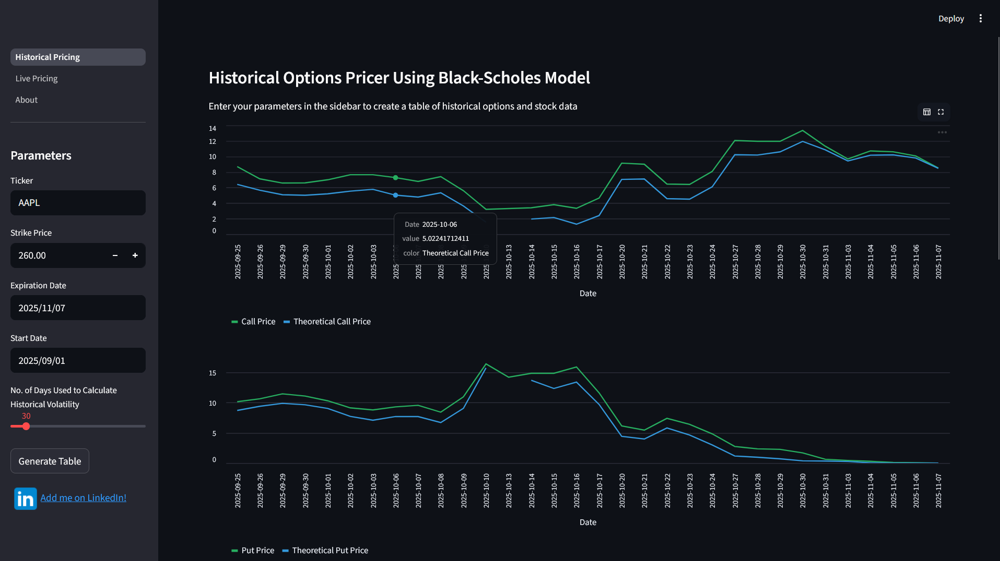
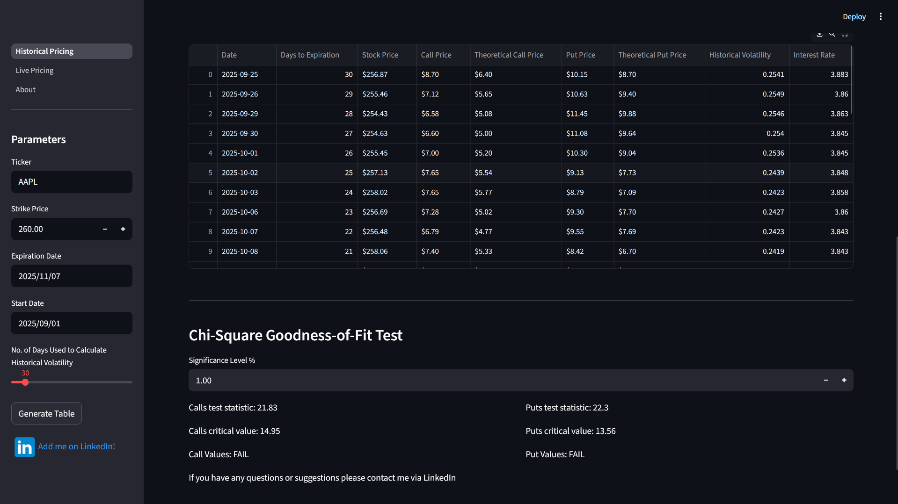
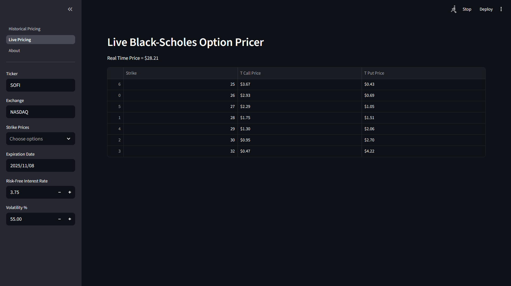

# Option Pricing Tool Using Black-Sholes Model

## Backtest the accuracy of the Black-Scholes option pricing formula on historical stock data

This project was built as part of my studies on mathematical finance. It allows you to do the following:

Historical Pricing page:
* Pull historical stock and option data for your given time frame
* Pull historical interest rate data
* Plot historical theoretical call and put prices against real prices
* Adjust historical volatility hyperparameter
* Test models for "Goodness-of-Fit"

Live-pricing page:
* Stream live stock price
* Calculate live theoretical call and put prices

## Tech Used
* Yahoo Finance API
* Streamlit powered UI
* Pandas and NumPy for data manipulation
* BeautifulSoup

## UI

### Pricing graphs and sidebar

Input your desired variables in the sidebar, here we want to see the data for AAPL options, strike price $260, expiring on the 28th November 2025. The app has pulled all the necessary historical data, and calculated the theoretical prices. Note these theoretical prices are the prices you would actually calculate on that date, they don't use any data from further in the future. You can use these graphs to assess the accuracy of the model, and tweak the "Days Used" hyperparameter to optimise the fit and study its significance. Here we see both the call and put prices have a decent fit, but the model underestimates in both cases. From this we know that for AAPL the implied volatility has been significantly higher that the realised historical volatility.



### Dataframe and Chi-Square Test

After scolling down you will see a dataframe containing all the information pulled and calculated by the app. Streamlit allows you to easily click and download this table which is very handy. Underneath the table there is a section that carries out a Chi-Square Goodness-of-Fit test. I'll be honest, I'm not sure if this test is mathematically rigorous, but it just gives you a quick idea of how well the model is fitting the data. In this example the model fails both tests due to the underestimation problem mentioned earlier.



### Live Pricing page

Input the desired stock, expiry date and strike prices in the sidebar. The app then streams the **real time** stock price and gives you a list of **real time** theoretical option prices. I've found that after tweaking the variables, the price it gives you can be very accurate and can inform trading decisions.



## Usage Instructions
To use this app, [try the online version here](https://historical-pricing.streamlit.app/). If this fails, install the files and run from the command line using the following command:

```
python -m streamlit run Historical_Pricing.py
```
